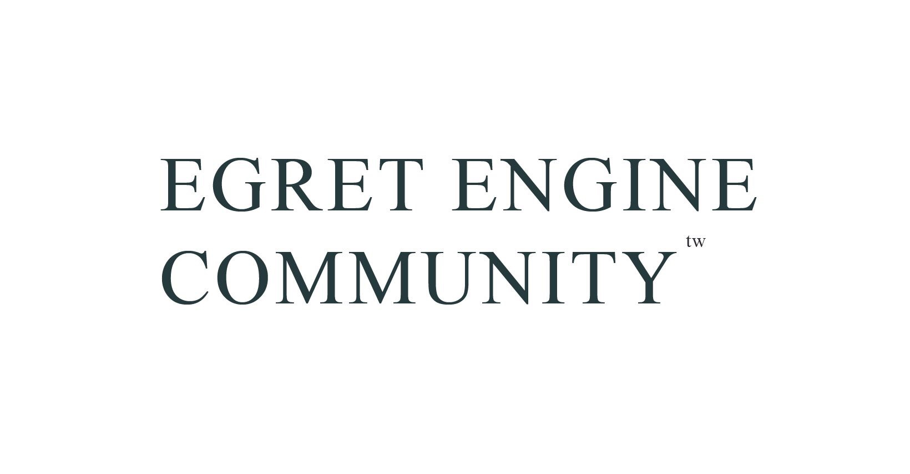

　　本篇教程目的在幫助初入 Egret 這套遊戲引擎的使用者更快上手，比起官方文檔，這篇教程在某種程度上會更容易理解，不過還是建議搭配官方的開發者文件一起學習。

　　本技術團隊在開發的過程中，不斷尋找複用性更高及協同開發更簡易的架構，並持續優化改良，而設計出來的專案開發架構也會在教程中說明。

# About

Tech Team: [Egret Engine Community TW](https://www.facebook.com/groups/egret.community.tw/)

GitBook: [Egret_Engine_Tutorial](https://egret-engine-community-tw.gitbook.io/egret-engine-tutorial/)

Contact: 

> Jae Chuang: utopia.jae@gmail.com
>
> Ollie Ou: ollieotc@gmail.com

## Updated

20190515 ( jae ) : EP01 ~ EP06-2