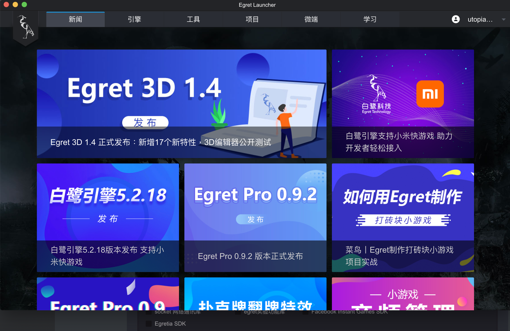

# 環境配置

###下載 [Egret Launcher](https://www.egret.com/cn/products/engine.html)

安裝完進入Egret Launcher選擇引擎，安裝最新的穩定版本，日後若開啟的專案不是對應的版本再去安裝即可。

###安裝工具 Egret Wing 3

此款編譯器針對Egret量身打造，有時候會有一些毛病，不過整體上是還算不錯，建議都使用Wing作為開發Egret專案的工具。

完成後就可以開始準備創建專案了！

