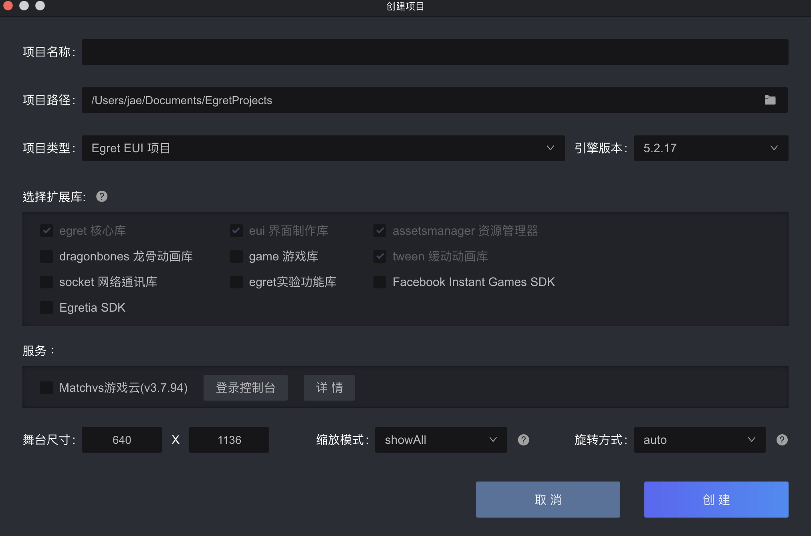

# 創建項目

**在Egret Launcher：選擇項目 > 創建項目**

自訂項目名稱及路徑，類型選擇Egret EUI項目就可以，引擎版本也是依照專案的需求去選擇對應的版本，這邊特別要注意的是中間選擇擴展庫的地方，Egret除了支援第三方函式庫外也有本身的核心庫，詳細文檔[請參考](http://developer.egret.com/cn/github/egret-docs/extension/threes/instructions/index.html)，原則上是依照個人需求去選擇，不過就算日後要再新增或刪減核心庫也可直接透過修改 egretProperties.json去操作。

再來設定畫面的部分：舞台尺寸、縮放模式及旋轉模式，如果要在手機上也能使用，建議旋轉方式選擇 landScape，設定完成後直接點擊創建，在選擇的路徑下就會出現一個Egret的專案了。

