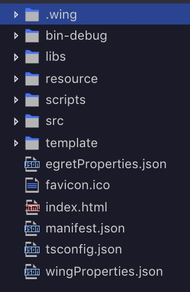

# 項目內容

使用 Egret Wing 3 將專案打開或是用 Egret Launcher 裡面的項目介面操作，打開會看到初始專案，內容如下：

 **.wing**：包括 Egret 項目的任務配置文件和啟動配置文件

**bin-debug**：項目調試時，所產生的文件存放於此目錄

**libs**：庫文件，包括 Egret 核心庫和其他擴展庫存放於此目錄

**resource**：項目資源文件存放於此目錄

**scripts**：項目構建和發佈時需要用到的腳本文件存放在此目錄

**src**：項目代碼文件存放於此目錄

**template**：項目模板文件存放於此目錄

**egretProperties.json**：項目的配置文件

**favicon.ico**：圖標

**index.html**：入口文件

**wingProperties.json**：Egret Wing 3 項目配置文件

**manifest.json**：網頁清單文件

**tsconfig.json**：typescript 編譯配置文件

最常會使用到的是resource、src、template/web/index.html，其他的資料夾及檔案則在特定情況會使用。

