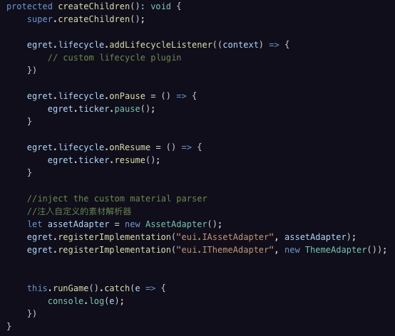
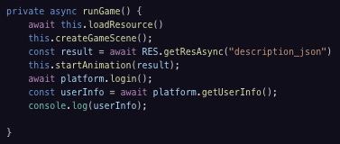

# 節點概念 with Main.ts

節點概念會是開發Egret專案的核心，先從簡單的部分開始講起。

看到Main.ts，這支檔案主要負責載入功能及場景，也就是整個專案最核心的角色-初始化運作中的要角，在遊戲執行的過程中他隨時都會在，如果比喻成一棵樹，畫面上的一切是樹枝跟樹葉，它就是整個遊戲的樹根。

**createChildren()**：這個Egret已經封裝好的方法會在創建場景時，也就是在創建 Main 這個類別的實體時執行。

首先進行生命週期管理器的配置，關於生命週期管理器[請參考](http://developer.egret.com/cn/github/egret-docs/Engine2D/getStarted/lifecycle/index.html)。

然後用Egret封裝好的方法設定src資料夾中AssetAdapter 和 ThemeAdapter 這兩個類別的配置，此處偏底層的配置。

接著呼叫 runGame() 這個方法 

**在 runGame() 中

****this.loadResource()** 執行了 loading 畫面的操作，**this.createGameScene()** 則是創建畫面。

**const result = await RES.getResAsync("description_json")**

**this.startAnimation(result)**

則是執行畫面上的動畫，其中RES是Egret封裝好的加載資源方法，[請參考](https://developer.egret.com/cn/article/index/id/118)。

第五行和第六行 platform 的方法是用來串接api，這部分後面會再詳細說明，可以先略過。

到這邊可以知道順序會是：載入讀取畫面 > 創建場景 > 設定動畫 > 串接API接口