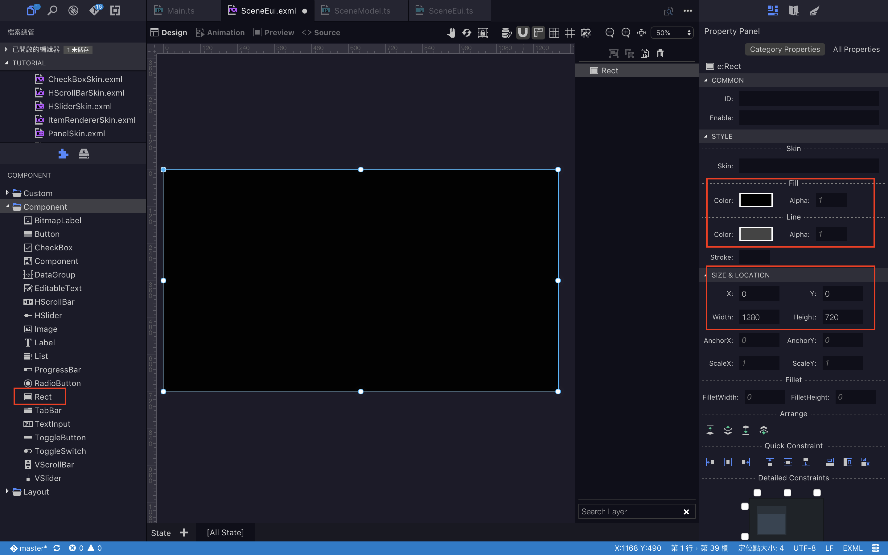

# 串聯Model與EUI

當把架構重構成 Main - SceneModel - SceneEui 後，**Model 用於存放該場景的資料及佈局，EUI 負責畫面上的一切，本章節會開始講關於 Eui(Exml) 的操作**，目前畫面上還不會有任何東西，因為原本在 Main 中 createGameScene() 的方法內容已經被我們移除替換了，要重新建立畫面上的元件，

首先來看 SceneEui.exml：


在Wing打開會是可視化介面，先來看左下角會發現一塊拼圖和兩本疊再一起的書，拼圖是EUI的元件，另一個則是專案的資源庫，可以取得圖片等資源。

首先調整大小，先確認當前的舞台規格為何，這邊先更改為1280 * 720，打開 template/web/index.html 找到舞台規格的地方做更改，改完後再回到 SceneEui.exml 設定這個檔案的舞台大小：

**點選中間工作區空白處，調整右方SIZE & LOCATION 中的 寬高**


接著來做畫面上的佈局

**選擇左邊拼圖中的 Component > Rect，如果有圖片也可以使用 Image，這邊就使用簡單的色塊當背景，選擇後拖拉到畫面中間，調整右邊的顏色、座標、寬高等樣式。**



這樣簡單的背景就有了，接著上個標題，**選擇Component > Label，一樣調整右邊的文字及顏色樣式。**


這個時候run專案看一下結果，簡單的畫面就完成了。


可以嘗試找自己想要的圖片或按鈕的素材，玩玩看各種EUI元件，大致上就是從可視化介面左下角選擇要新增的 EUI元件，拖拉到畫面上再調整樣式即可。

----

###做一個按鈕，按下去後標題會改變的功能。

首先在 Exml 先新增按鈕的元件，Component > Button 拖拉到工作區


到這邊或許會疑惑似乎沒地方能寫邏輯，如果要寫邏輯的話就要去一開始創建 SceneEui 的時候一起生成的SceneEui.ts 裡面改，所以 EUI元件就是：**在 Exml 調整樣式跟佈局，在 ts 編寫邏輯。**

現在要做的就是讓 SceneEui.ts 可以找到 Exml 裡面的元件，點選每個 EUI元件 會發現右邊都會有ID的欄位，先**將需要寫入邏輯的元件都設定ID**，再點選元件列表上的複製屬性鈕。


開啟 SceneEui.ts 貼上複製的屬性：

```
class SceneEui extends eui.Component implements eui.UIComponent {
	public title: eui.Label; // 標題
	public btn: eui.Button; // 按鈕

	public constructor() {
		super();
	}

	protected partAdded(partName: string, instance: any): void {
		super.partAdded(partName, instance);
	}

	protected childrenCreated(): void {
		super.childrenCreated();
	}
}
```

----

將按鈕掛載點擊的事件偵聽器，而掛載的地方**必須在 childrenCreated() 這個方法中使用**，因為這個方法會在 EUI元件 生成後觸發，若在建構子裡面操作會有元件尚未生成就掛載偵聽事件而報錯的問題，記得也要加上按鈕點擊觸發的方法。

```
class SceneEui extends eui.Component implements eui.UIComponent {

	public title: eui.Label;
	public btn: eui.Button;

	public constructor() {
		super();
	}

	protected partAdded(partName: string, instance: any): void {
		super.partAdded(partName, instance);
	}

	protected childrenCreated(): void {
		super.childrenCreated();

		// 掛載偵聽事件在按鈕上
		this.btn.addEventListener(egret.TouchEvent.TOUCH_TAP, this.clickAndChange, this)
	}

	/** 點擊按鈕觸發的功能：更換Title */
	private clickAndChange(): void {
		this.title.text = 'Egret is super easy !';
	}
}
```

這樣功能就完成了，一樣run起來看發現按鈕按下去標題就變了！


----

如果照著做卻無法成功，那有可能會是Egret底層EUI沒有配置到你建立的 SceneEui，可以去 resource/default.thm.json 檢查在exmls裡面是否有 SceneEui 的路徑。

```
{
    "skins": {
        "eui.Button": "resource/eui_skins/ButtonSkin.exml",
        "eui.CheckBox": "resource/eui_skins/CheckBoxSkin.exml",
        "eui.HScrollBar": "resource/eui_skins/HScrollBarSkin.exml",
        "eui.HSlider": "resource/eui_skins/HSliderSkin.exml",
        "eui.Panel": "resource/eui_skins/PanelSkin.exml",
        "eui.TextInput": "resource/eui_skins/TextInputSkin.exml",
        "eui.ProgressBar": "resource/eui_skins/ProgressBarSkin.exml",
        "eui.RadioButton": "resource/eui_skins/RadioButtonSkin.exml",
        "eui.Scroller": "resource/eui_skins/ScrollerSkin.exml",
        "eui.ToggleSwitch": "resource/eui_skins/ToggleSwitchSkin.exml",
        "eui.VScrollBar": "resource/eui_skins/VScrollBarSkin.exml",
        "eui.VSlider": "resource/eui_skins/VSliderSkin.exml",
        "eui.ItemRenderer": "resource/eui_skins/ItemRendererSkin.exml",
        "SceneEui": "resource/eui_skins/SceneEui.exml"
    },
    "autoGenerateExmlsList": true,
    "exmls": [
        "resource/eui_skins/ButtonSkin.exml",
        "resource/eui_skins/CheckBoxSkin.exml",
        "resource/eui_skins/HScrollBarSkin.exml",
        "resource/eui_skins/HSliderSkin.exml",
        "resource/eui_skins/ItemRendererSkin.exml",
        "resource/eui_skins/PanelSkin.exml",
        "resource/eui_skins/ProgressBarSkin.exml",
        "resource/eui_skins/RadioButtonSkin.exml",
        "resource/eui_skins/ScrollerSkin.exml",
        "resource/eui_skins/TextInputSkin.exml",
        "resource/eui_skins/ToggleSwitchSkin.exml",
        "resource/eui_skins/VScrollBarSkin.exml",
        "resource/eui_skins/VSliderSkin.exml",
        "resource/eui_skins/SceneEui.exml"
    ],
    "path": "resource/default.thm.json"
}
```


以上就是簡單的EUI操作。